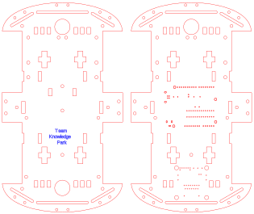
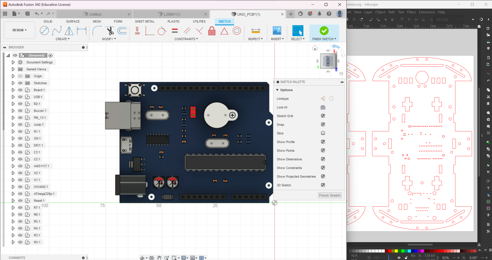

# Smart Roomba - Smart Agriculture Ecosystem Project

## Introduction

Welcome to the Smart Roomba project, part of the Smart Agriculture ecosystem developed by "Team Knowledge Park." This project combines the functionality of a household Roomba and a smart vacuum cleaner, making it a versatile and multifunctional system. The Smart Roomba can not only clean your home but also mow grass using its front blades and vacuum residues using the back vacuum cleaner.

## Features

- Automatic household cleaning: The Smart Roomba operates as a typical household Roomba, autonomously navigating and cleaning floors.
- Smart vacuum cleaner: It can effectively vacuum and collect residues from various surfaces.
- Grass cutting capabilities: The front blades enable it to efficiently cut grass in outdoor areas.
- Sustainable design: The base of the Smart Roomba has been meticulously designed using AutoCAD, and it incorporates all the necessary holes for Arduino, screws, and the L298N motor driver.

## Team Knowledge Park

This project has been entirely designed and developed by "Team Knowledge Park." We are a passionate group of enthusiasts with a strong background in robotics, agriculture, and engineering. Our goal is to create innovative solutions that improve agriculture practices and contribute to a sustainable future.

## Prizes and Achievements

We are proud to have received recognition and awards for our efforts. Our achievements include:

- Third prize in the Trinity Intercollege Science Competition.
- Second prize in Xfest organized by SEDSKMC.
- First prize in SETexpo - an inter-college science competition organized by Saint Xaviers Maitighar (SXC).

## How to Use

To deploy the Smart Roomba, follow these steps:

1. Assemble the Smart Roomba base by laser cutting the "4wdfin.dxf" file using K40 Whisperer. The base design ensures proper placement of Arduino, screws, and the L298N motor driver.
2. Upload the "roomba.ino" code onto the Arduino board.
3. Ensure the Smart Roomba is fully charged.
4. Place the Smart Roomba in the desired area for cleaning or grass cutting.
5. Sit back and let the Smart Roomba autonomously carry out the cleaning or grass cutting tasks.

## Contributing

We believe in the power of open-source collaboration. If you are interested in contributing to the Smart Roomba project, feel free to fork the repository, make improvements, and submit a pull request. We welcome ideas, bug fixes, and new features to make the Smart Agriculture ecosystem even better!

## Contact

For any inquiries or feedback, you can reach out to us at `contact@adit.com.np`.

---

Thank you for taking an interest in our Smart Roomba project. We hope this contribution to the Smart Agriculture ecosystem will benefit individuals and communities alike. Happy cleaning and grass cutting!